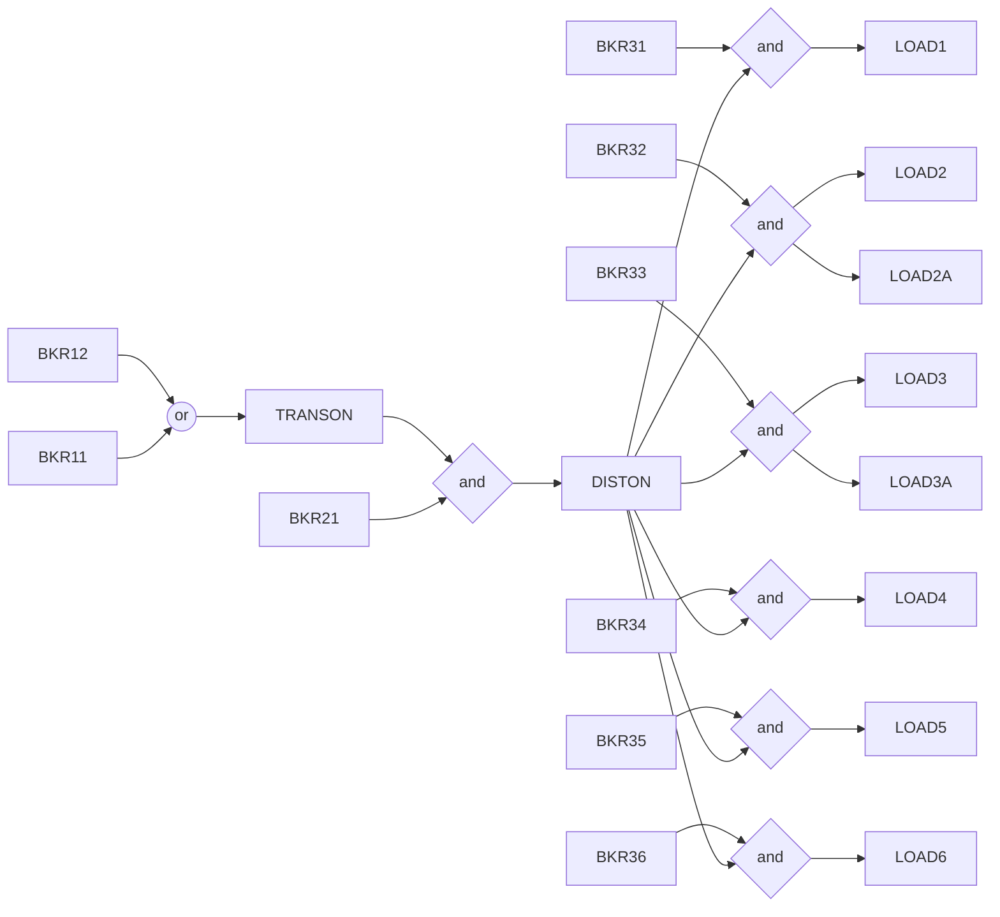

# PLC Flowcharts

## Substation (`107890.st`)



## ?? (`406635.st`)

```mermaid

flowchart LR


```

## Traffic_Light (`706957.st`)

```mermaid

flowchart LR

```

## ?? (`692121.st`)

```mermaid

flowchart LR

```
